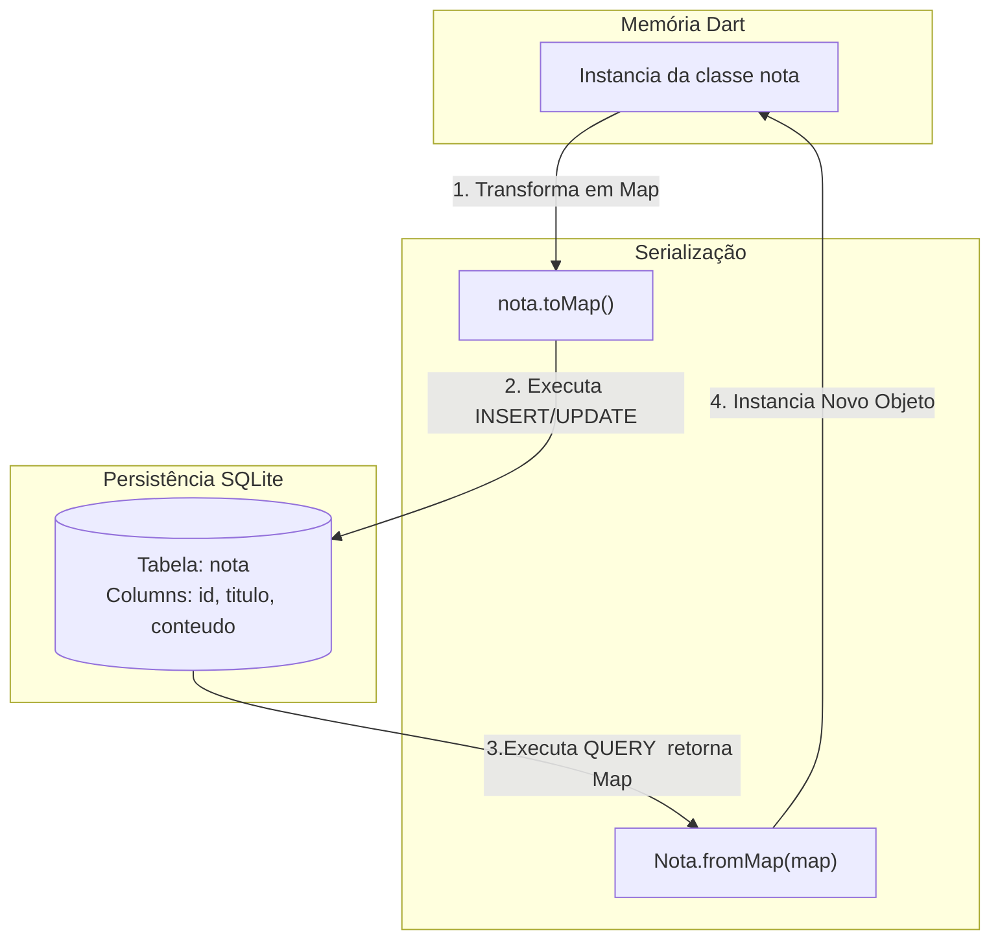

# Documetação de Arquitetura e Modelagem: Módulo de Persistência Local (Armazenamento Local)

Este documento descreve as decisões de modelagem de dados e o fluxo de persistência local utilizando o pacote `sqflite`integrado ao ecossitema Flutter.

---

## 1. Mapeamento Objeto-Relacional (ORM)

O `sqflite`se comunica natiovamente com dados estruturados na forma de pares de Linha/Coluna (`Map<String, dynamic>`). Abaixo, o diagrama ilustra o cilco de vida e a transformação sofrida pelo dado desde a memória da aplicação (Objeto) até o disco de armazenamento (Tabela SQLite).

## Modelagem de entidade e relacionamento (MER)