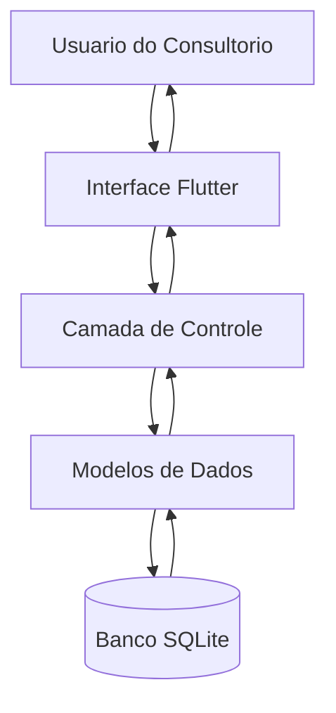
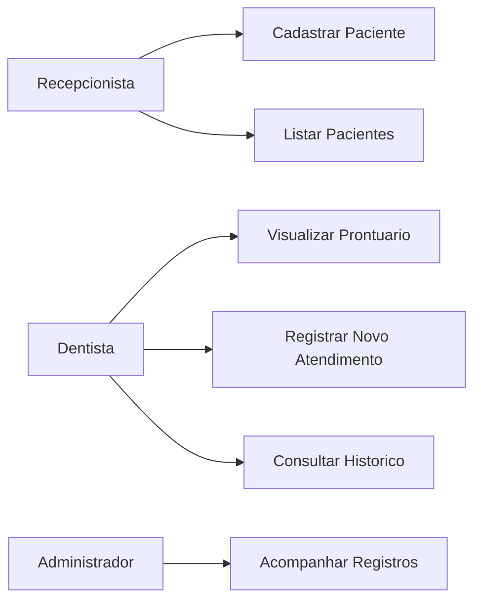
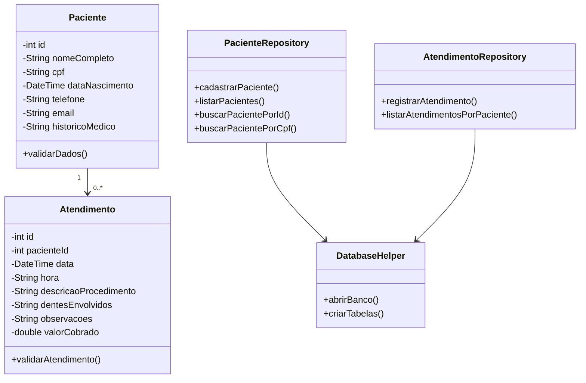
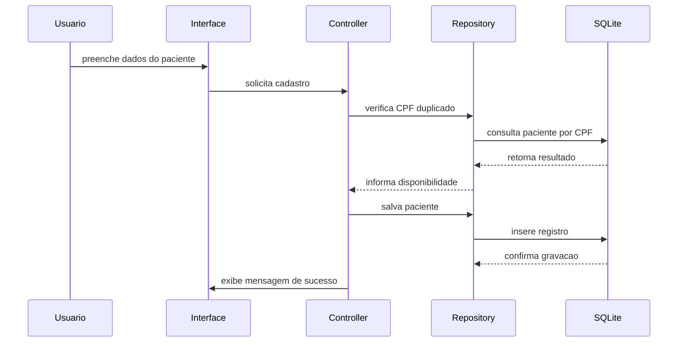
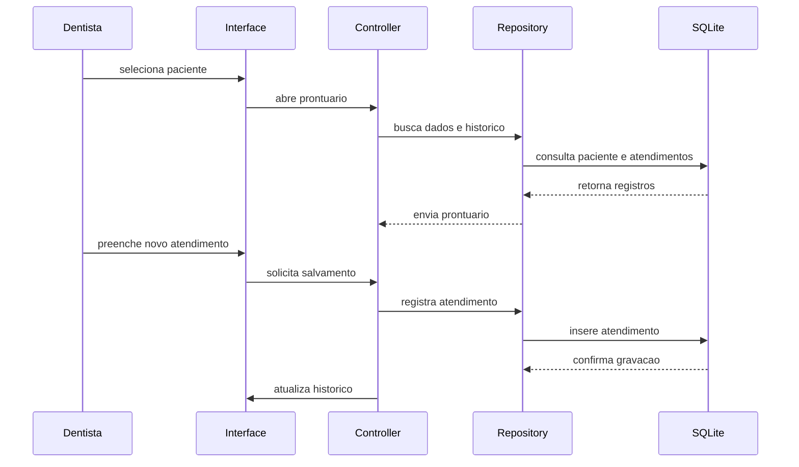

# Documentacao de Especificacao de Requisitos de Software (SRS)

## Sistema de Agendamento - Consultorio Odontologico

**Padrao de referencia:** ISO/IEC/IEEE 29148:2018  
**Versao:** 1.0.0  
**Data:** 2026-06-11  
**Autor:** Kaio Martinez Jorge  
**Projeto:** sa_clinica_sqlite

---

## 1. Introducao

### 1.1 Proposito

Este documento descreve os requisitos do sistema **Sistema de Agendamento - Consultorio Odontologico**, desenvolvido para organizar o cadastro de pacientes, a visualizacao de prontuarios e o registro de atendimentos odontologicos.

O documento tem como objetivo:

- definir as funcionalidades principais do sistema;
- padronizar o entendimento sobre a atividade proposta;
- servir como base para desenvolvimento, testes e manutencao;
- documentar regras de negocio e criterios de aceitacao.

---

### 1.2 Escopo

O sistema permitira:

- cadastro inicial de pacientes;
- consulta dos dados cadastrais do paciente;
- visualizacao do prontuario do paciente;
- registro de novos atendimentos odontologicos;
- armazenamento do historico de procedimentos realizados.

O sistema sera uma aplicacao mobile desenvolvida em:

- Flutter;
- Dart;
- SQLite para armazenamento local dos dados.

---

### 1.3 Definicoes

| Termo             | Definicao                                                                 |
| ----------------- | ------------------------------------------------------------------------- |
| Paciente          | Pessoa cadastrada no sistema para receber atendimento odontologico        |
| Prontuario        | Registro com dados pessoais, historico medico e historico de atendimentos |
| Atendimento       | Consulta ou procedimento realizado para um paciente                       |
| Procedimento      | Descricao do tratamento odontologico realizado                            |
| Dentes envolvidos | Identificacao dos dentes relacionados ao procedimento                     |

### Acronimos

- **SACCO** - Sistema de Agendamento - Consultorio Odontologico;
- **RF** - Requisito Funcional;
- **RNF** - Requisito Nao Funcional;
- **RN** - Regra de Negocio;
- **SRS** - Software Requirements Specification.

---

### 1.4 Visao Geral do Documento

Este documento esta organizado em:

- introducao e escopo;
- descricao geral do sistema;
- requisitos funcionais e nao funcionais;
- regras de negocio;
- modelos do sistema;
- analise de riscos;
- controle de versoes.

---

## 2. Descricao Geral do Sistema

### 2.1 Perspectiva do Sistema

O sistema sera uma aplicacao mobile standalone, com armazenamento local em SQLite. O usuario podera cadastrar pacientes, acessar seus prontuarios e registrar atendimentos realizados no consultorio.

---

### 2.2 Funcoes do Sistema

O sistema deve:

- cadastrar pacientes;
- validar dados obrigatorios;
- listar pacientes cadastrados;
- exibir o prontuario de um paciente;
- registrar novos atendimentos;
- exibir o historico de atendimentos e procedimentos;
- armazenar os dados localmente.

---

### 2.3 Classes de Usuarios

| Usuario       | Descricao                                                   |
| ------------- | ----------------------------------------------------------- |
| Recepcionista | Realiza o cadastro inicial e consulta pacientes             |
| Dentista      | Visualiza prontuarios e registra atendimentos/procedimentos |
| Administrador | Pode acompanhar registros e validar informacoes do sistema  |

---

### 2.4 Ambiente Operacional

- Aplicativo mobile Flutter;
- Dispositivos Android;
- Armazenamento local com SQLite;
- Execucao sem necessidade obrigatoria de internet.

---

### 2.5 Restricoes

- O sistema utiliza banco de dados local;
- Nao ha sincronizacao em nuvem na versao inicial;
- Nao ha autenticacao de usuario na versao inicial;
- Os dados ficam armazenados no dispositivo;
- O CPF deve ser utilizado para evitar cadastro duplicado.

---

### 2.6 Suposicoes

- O usuario possui conhecimento basico de uso de aplicativos mobile;
- O consultorio tera baixo ou medio volume de registros;
- Os dados inseridos devem ser conferidos pelo usuario antes do salvamento;
- O historico medico informado sera utilizado como apoio ao atendimento odontologico.

---

## 3. Requisitos do Sistema

### 3.1 Requisitos Funcionais

#### RF-001: Cadastro de Paciente

**Descricao:** Permitir o registro inicial de um paciente no sistema.

**Prioridade:** Alta  
**Versao:** 1.0  
**Data:** 2026-06-11  
**Rastreabilidade:** Proposta da Atividade 9 - Registro Inicial

**Dados de entrada:**

- nome completo;
- CPF;
- data de nascimento;
- telefone;
- e-mail;
- historico medico relevante.

**Criterios de Aceitacao:**

- [ ] O sistema deve permitir preencher todos os campos do paciente.
- [ ] O nome completo deve ser obrigatorio.
- [ ] O CPF deve ser obrigatorio e unico.
- [ ] A data de nascimento deve ser valida.
- [ ] O telefone deve ser informado para contato.
- [ ] O sistema deve salvar o paciente no banco SQLite.
- [ ] O sistema deve exibir uma mensagem de sucesso apos o cadastro.

---

#### RF-002: Listagem de Pacientes

**Descricao:** Permitir visualizar os pacientes cadastrados.

**Prioridade:** Alta  
**Versao:** 1.0  
**Data:** 2026-06-11  
**Rastreabilidade:** Necessidade de acesso ao prontuario

**Criterios de Aceitacao:**

- [ ] O sistema deve listar os pacientes cadastrados.
- [ ] A listagem deve exibir pelo menos nome, CPF e telefone.
- [ ] O usuario deve conseguir selecionar um paciente.
- [ ] Caso nao existam pacientes, o sistema deve informar que nao ha registros.

---

#### RF-003: Visualizacao do Prontuario do Paciente

**Descricao:** Permitir visualizar o registro completo do paciente selecionado.

**Prioridade:** Alta  
**Versao:** 1.0  
**Data:** 2026-06-11  
**Rastreabilidade:** Proposta da Atividade 9 - Visualizacao do Registro

**Dados exibidos:**

- nome completo;
- CPF;
- data de nascimento;
- telefone;
- e-mail;
- historico medico relevante;
- historico de atendimentos;
- procedimentos realizados.

**Criterios de Aceitacao:**

- [ ] O sistema deve exibir os dados cadastrais do paciente.
- [ ] O sistema deve exibir o historico medico relevante.
- [ ] O sistema deve exibir todos os atendimentos registrados para o paciente.
- [ ] O sistema deve manter a associacao correta entre paciente e atendimentos.

---

#### RF-004: Registro de Novo Atendimento

**Descricao:** Permitir adicionar um novo atendimento ao prontuario do paciente selecionado.

**Prioridade:** Alta  
**Versao:** 1.0  
**Data:** 2026-06-11  
**Rastreabilidade:** Proposta da Atividade 9 - Adicao de Elementos ao Registro

**Dados de entrada:**

- data do atendimento;
- hora do atendimento;
- descricao do procedimento;
- dentes envolvidos;
- observacoes;
- valor cobrado.

**Criterios de Aceitacao:**

- [ ] O atendimento deve ser vinculado a um paciente existente.
- [ ] A data e a hora devem ser obrigatorias.
- [ ] A descricao do procedimento deve ser obrigatoria.
- [ ] O campo de dentes envolvidos deve permitir informar um ou mais dentes.
- [ ] O valor cobrado deve aceitar somente valores numericos validos.
- [ ] O sistema deve salvar o atendimento no banco SQLite.
- [ ] O novo atendimento deve aparecer no historico do prontuario.

---

#### RF-005: Historico de Atendimentos

**Descricao:** Permitir consultar os atendimentos e procedimentos realizados para cada paciente.

**Prioridade:** Alta  
**Versao:** 1.0  
**Data:** 2026-06-11  
**Rastreabilidade:** Necessidade de acompanhamento clinico

**Criterios de Aceitacao:**

- [ ] O historico deve mostrar data e hora do atendimento.
- [ ] O historico deve mostrar descricao do procedimento.
- [ ] O historico deve mostrar dentes envolvidos, observacoes e valor cobrado.
- [ ] Os atendimentos devem ser exibidos em ordem cronologica.
- [ ] Caso o paciente nao possua atendimentos, o sistema deve informar que o historico esta vazio.

---

### 3.2 Requisitos Nao Funcionais

#### RNF-001: Usabilidade

**Descricao:** A interface deve ser simples, clara e adequada para uso em consultorio odontologico.

---

#### RNF-002: Desempenho

**Descricao:** As principais operacoes de cadastro, listagem e consulta devem responder rapidamente, preferencialmente em menos de 1 segundo para baixo volume de dados.

---

#### RNF-003: Persistencia Local

**Descricao:** Os dados devem ser armazenados localmente utilizando SQLite.

---

#### RNF-004: Confiabilidade

**Descricao:** O sistema deve validar entradas obrigatorias antes de salvar registros.

---

#### RNF-005: Manutenibilidade

**Descricao:** O codigo deve ser organizado em camadas ou componentes, separando interface, regra de negocio e acesso a dados sempre que possivel.

---

#### RNF-006: Privacidade

**Descricao:** Como o sistema armazena dados pessoais e historico medico, o acesso ao dispositivo deve ser protegido pelo usuario responsavel.

---

## 4. Regras de Negocio

| Regra de Negocio | Descricao                                                            |
| ---------------- | -------------------------------------------------------------------- |
| RN-001           | O nome completo do paciente e obrigatorio                            |
| RN-002           | O CPF do paciente e obrigatorio e nao pode ser duplicado             |
| RN-003           | A data de nascimento nao pode ser futura                             |
| RN-004           | Um atendimento so pode ser registrado para um paciente ja cadastrado |
| RN-005           | A data e a hora do atendimento sao obrigatorias                      |
| RN-006           | A descricao do procedimento e obrigatoria                            |
| RN-007           | O valor cobrado nao pode ser negativo                                |
| RN-008           | Todo atendimento registrado deve aparecer no prontuario do paciente  |
| RN-009           | O historico medico relevante deve ficar associado ao paciente        |

---

## 5. Modelos do Sistema

### 5.1 Diagrama de Casos de Uso

---

### 5.2 Diagrama de Classes UML

---

### 5.3 Diagrama de Sequencia

#### 5.3.1 Cadastro de Paciente

#### 5.3.2 Registro de Atendimento

---

## 6. Modelo de Dados Sugerido

### 6.1 Tabela `pacientes`

| Campo                  | Tipo    | Restricao                      |
| ---------------------- | ------- | ------------------------------ |
| id                     | INTEGER | Chave primaria, autoincremento |
| nome_completo          | TEXT    | Obrigatorio                    |
| cpf                    | TEXT    | Obrigatorio, unico             |
| data_nascimento        | TEXT    | Obrigatorio                    |
| telefone               | TEXT    | Obrigatorio                    |
| email                  | TEXT    | Opcional                       |
| procedimento_realizado | TEXT    | Opcional                       |

---

### 6.2 Tabela `atendimentos`

| Campo                  | Tipo    | Restricao                          |
| ---------------------- | ------- | ---------------------------------- |
| id                     | INTEGER | Chave primaria, autoincremento     |
| paciente_id            | INTEGER | Chave estrangeira para pacientes   |
| data                   | TEXT    | Obrigatorio                        |
| hora                   | TEXT    | Obrigatorio                        |
| descricao_procedimento | TEXT    | Obrigatorio                        |
| observacoes            | TEXT    | Opcional                           |
| valor_cobrado          | REAL    | Obrigatorio, maior ou igual a zero |

---

## 7. Analise de Risco

| Risco                                      | Impacto | Mitigacao                                                           |
| ------------------------------------------ | ------- | ------------------------------------------------------------------- |
| Perda de dados locais                      | Alto    | Realizar backup do banco quando possivel                            |
| CPF cadastrado incorretamente              | Medio   | Validar formato e permitir conferencia antes de salvar              |
| Dados medicos expostos                     | Alto    | Orientar protecao do dispositivo e evitar compartilhamento indevido |
| Registro de atendimento no paciente errado | Alto    | Exibir nome e CPF do paciente antes de salvar o atendimento         |
| Campos obrigatorios vazios                 | Medio   | Validar formulario antes do cadastro                                |

---

## 8. Criterios Gerais de Teste

- cadastrar paciente com dados validos;
- impedir cadastro de paciente sem nome;
- impedir cadastro de CPF duplicado;
- listar pacientes cadastrados;
- abrir prontuario de um paciente;
- registrar atendimento para paciente selecionado;
- impedir atendimento sem data, hora ou descricao;
- validar valor cobrado negativo;
- conferir se o atendimento aparece no historico correto.

---

## 9. Controle de Versoes

### 9.1 Historico de Alteracoes

| Versao | Data       | Autor               | Modificacao                                   |
| ------ | ---------- | ------------------- | --------------------------------------------- |
| 1.0.0  | 2026-06-11 | Kaio Martinez Jorge | Versao inicial da documentacao da Atividade 9 |

---

### 9.2 Aprovacoes

| Papel        | Nome                | Data       | Assinatura |
| ------------ | ------------------- | ---------- | ---------- |
| Professor(a) |                     |            |            |
| Aluno        | Kaio Martinez Jorge | 2026-06-11 |            |
